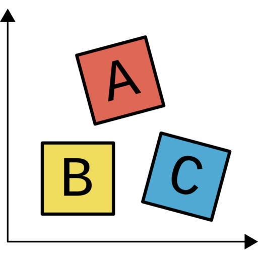

# Preface {.unnumbered}

ABCs of data science is intended for anyone who wants to learn more about data science, regardless of skill level. It aims to give readers a high level overview of various data science concepts, so that they can explore these topics further. It was primarily written in 2020-2021, before the explosion in popularity of Large Language Models.

ABCs of data science was created by [Graham Clendenning](https://github.com/gclen) who has worked as a data scientist in the public sector since 2015.

