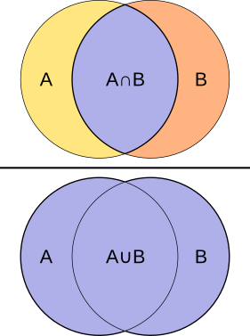

---
aliases:
- /blog/j-is-for-jaccard
categories:
- data_science
- embeddings
- distance_measures
comments: false
date: '2020-09-27'
description: " "
layout: post
mathjax: true
permalink: /blog/j-is-for-jaccard
title: J is for Jaccard metric
toc: false

---

In [previous blogs](../2020-05-03-e-is-for-embeddings/index.qmd) we’ve talked about choosing a distance measure as a way of saying “these two things are close if ...”. One useful measure is Jaccard similarity/distance since it measures the similarity between two sets. This is useful if you have a lot of categorical variables (i.e. ones that don’t have any inherent ordering). For example, two people are probably similar if they have the same sets of interests/hobbies. The Jaccard similarity of two sets is just the size of the intersection divided by the size of the union. Or put visually:

### Jaccard similarity/distance

As a more concrete example let’s imagine that we have collected a list of people’s favourite pizza toppings and we want to find which people are most similar. 

* Kara likes pepperoni, mushrooms, and green peppers
* Zach likes ham, pineapple, and jalapeno peppers
* Rodney also likes pepperoni, mushrooms, and green peppers
* Sophie likes olives, ham, pepperoni, and mushrooms

 So what are the Jaccard similarities between these people?

* Kara and Rodney like exactly the same toppings so their similarity is 1
* Rodney and Zach have nothing in common so their similarity is 0
* Kara and Sophie have some things in common but Sophie enjoys more toppings. Their similarity is 0.4 ([pepperoni, mushrooms]/[pepperoni, mushrooms, olives, ham, green peppers])

You’ll notice that two sets that are exactly the same have a similarity of 1. To change this into a distance we just to

$$ D_{Jaccard} = 1 - similarity $$

Now Kara and Rodney have a distance of 0, while Rodney and Zach are a distance of 1 (which in this case is as far apart as you can be).

### Hellinger distance

You might have noticed that Jaccard distance doesn’t take into account how frequently the items in the set occur. If counts do matter for your problem, then you will want to use [Hellinger distance](https://en.wikipedia.org/wiki/Hellinger_distance). Let’s imagine you have some data on the number of times people have read a given book:

| | Harry Potter | Hello World | The Hobbit | The Great Gatsby | Trick Mirror |
|:---------:|:-----:|:------:|:------:| :------:| :------:|
| Marie | 5 | 0 | 1 | 1 | 0 |
| Jordan | 1 | 0 | 1 | 1 | 1 | 
| Sarah | 0 | 2 | 0 | 1 | 1 |
| Patrick | 4 | 0 | 2 | 1 | 0 |

Marie, Jordan, and Patrick have all read Harry Potter which would make them similar under Jaccard similarity. However, Marie and Patrick are probably more similar since they both read it multiple times. Hellinger distance takes this into account. I’ll try to give you some intuition for how it does this. 

Imagine that each set of counts is generated by some weighted multi-sided die (that is different for each person). When we roll Maries die, it is more likely to come up with Harry Potter and less likely to come up with Hello World. The opposite is true for Sarah’s die, which is more likely to come up with Hello World and less likely to come up with Harry Potter. We calculate what the weights of these dice look like (these are called multinomial distributions).

We can then measure the mutual likelihood of these distributions. This just means “what is the probability of Jordans counts occuring using Maries die (and vice versa)”. If there is a high probability that Jordans counts occurred using Maries die, then Marie and Jordan should be considered close. If it is unlikely that Sarah’s counts occurred using Maries die, then Marie and Sarah should be pushed apart.

Hellinger distance is particularly useful if you have a bunch of text. You can consider two documents similar if you have the same words occurring at similar frequencies. 

### Summary

Jaccard and Hellinger are both very useful distance measures that can be used in dimension reduction and embeddings. If counts matter, use Hellinger, otherwise use Jaccard distance.

### Other resources

* [Embed all the things - John Healy (talk from Pydata Los Angeles 2019)](https://www.youtube.com/watch?v=OtVR_ZnXLu4&list=PLGVZCDnMOq0pHVE3SB0ecki__VMncQPKo&index=41&t=0s)

